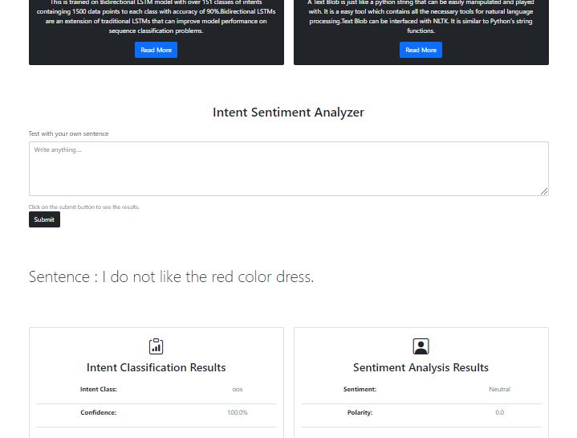

# Intent and Sentiment classifier App
> An app which is able to detect the polarity of sentence and intent of that sentence with confidence level.This project is done by using LSTM model with 90% accuracy and 0.50 loss on validation data.
The data can be downloaded from [CLINC150](https://github.com/clinc/oos-eval) that contains 10 real-world problem domains having 150 distinct intent classes(with 15 classes in each domain), each with 100 train, 20 validation, 30 test samples.

# What is this dataset for?
This dataset is for evaluating the performance of intent classification systems in the presence of "out-of-scope" queries. By "out-of-scope", we mean queries that do not fall into any of the system-supported intent classes. Most datasets include only data that is "in-scope". Our dataset includes both in-scope and out-of-scope data. You might also know the term "out-of-scope" by other terms, including "out-of-domain" or "out-of-distribution".

## Requirements  (Prerequisites)
* Linux or Windows
* Python 3.8 and up

For Windows

`git clone https://github.com/shubendu/Intent-Sentiment-Analysis.git`

## Install project dependencies:

`$ pip install -r requirements.txt`

Then simply apply the migrations:

    $ python app.py
    

 
## Demo
For live demo click [here](https://intent-senti-app.herokuapp.com/)

## Tech Stack / Built With
1. Flask - The python framework
2. Bootstrap4 
3. Heroku (for deployment)
## Authors

- [@shubendu](https://www.github.com/shubendu)

  
## 🔗 Links

  